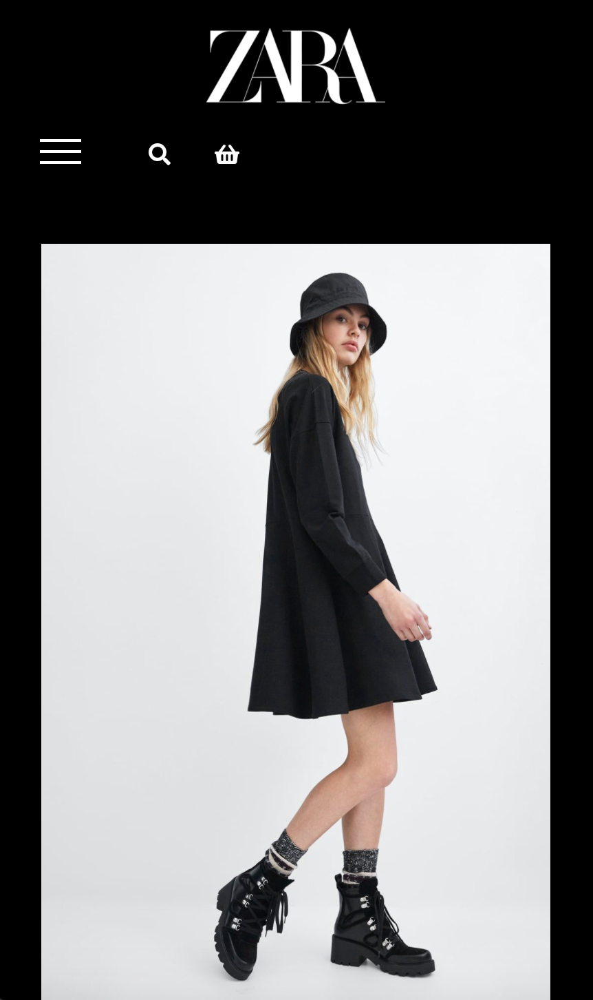
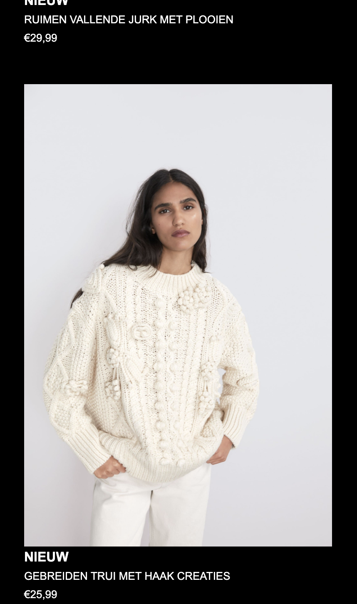
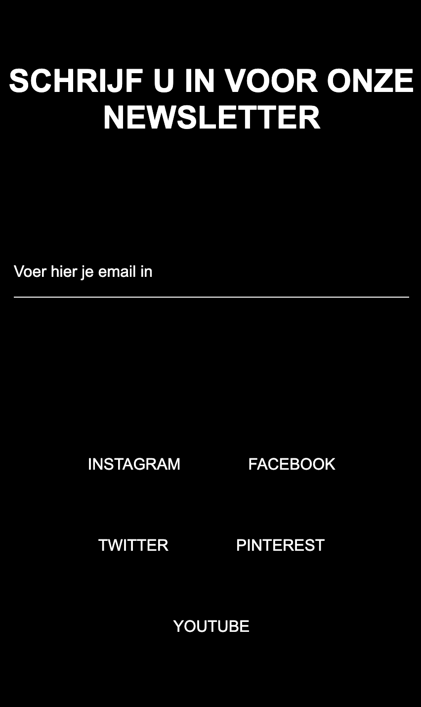
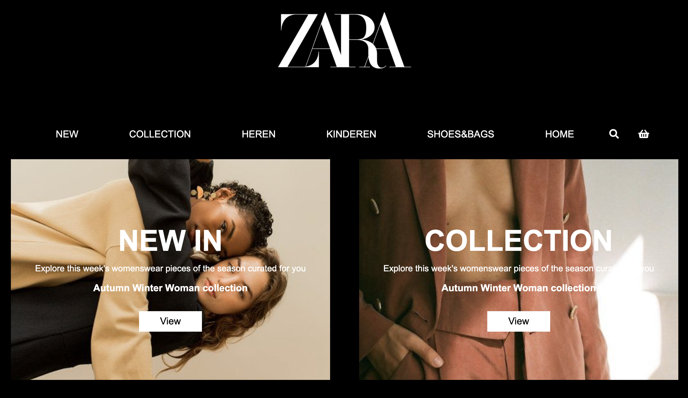
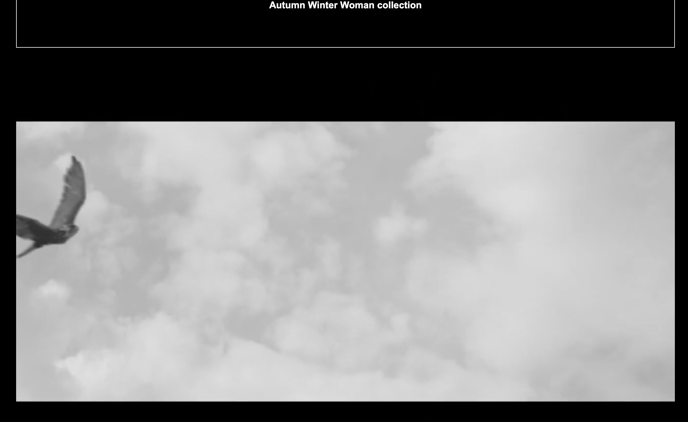
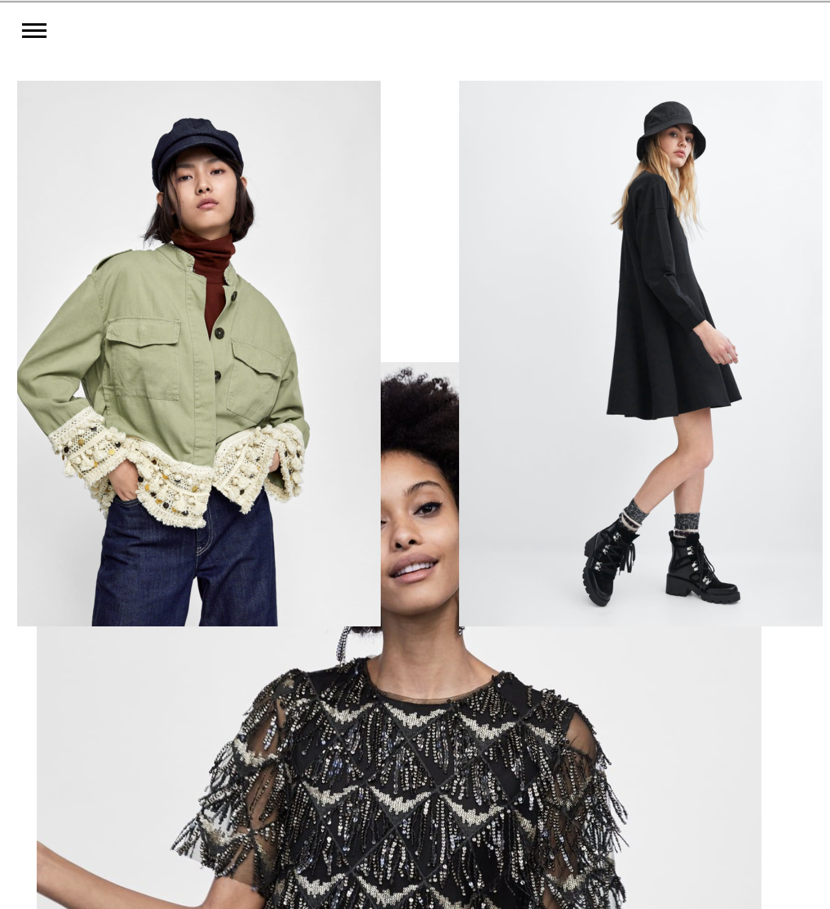
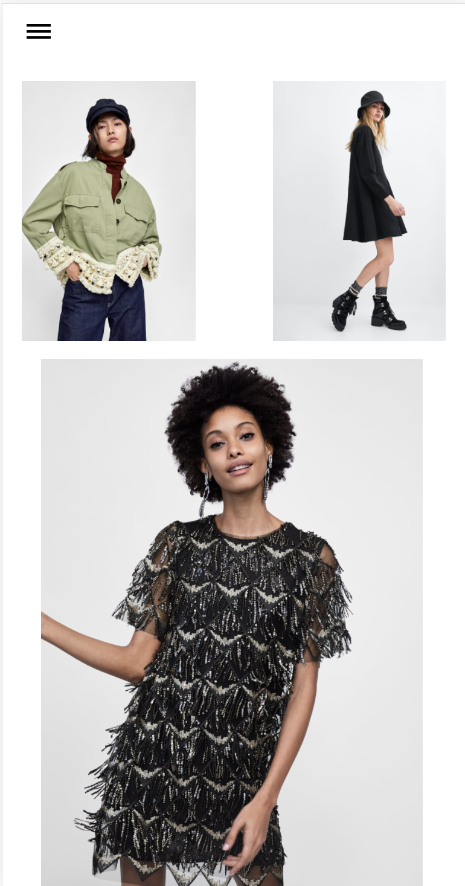
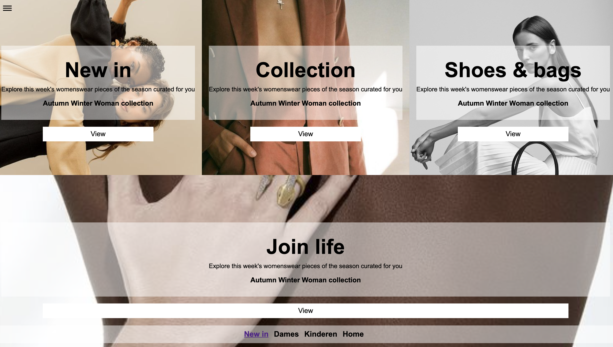

# Procesverslag
**Auteur:** -marlène van Erp-

Markdown cheat cheet: [Hulp bij het schrijven van Markdown](https://github.com/adam-p/markdown-here/wiki/Markdown-Cheatsheet). Nb. de standaardstructuur en de spartaanse opmaak zijn helemaal prima. Het gaat om de inhoud van je procesverslag. Besteedt de tijd voor pracht en praal aan je website.

## Bronnenlijst
1. -bron afbeeldingen: www.pinterest.com 
2. -bron stukjes code: www.w3schools.com
3. -bron css tricks: www.csstricks.com 

## Eindgesprek (week 7/8)

-dit ging goed & dit was lastig-
Eerste instantie wilde ik de zara site gaan namaken, maar uiteindelijk heb ik hem verbeterd. Het namaken werd op een gegeven moment heel lastig. 
Ik heb de cardflip van vorige keer weggehaald want het was echt een chaos op het scherm. Ik heb geexperimenteerd met het responsive maken van mijn navbar EN DAT IS GELUKT. 

Wat ik lastig vond is het centeren van mijn video. Kreeg het maar niet voor elkaar. 
**Screenshot(s):**

-screenshot(s) van je eindresultaat-

## Voortgang 3 (week 6)

-same as voortgang 1-

Ik heb deze week gewerkt aan animaties. Dit ging matig omdat ik vast liep meet een cardflip via css. Het werkt alleen de tekst komt boven de card in plaats gecentered en mooi. Wat wel goed ging is mediaquerie en dat werkt! helaas probeerde ik ook javascript uit maar dat heb ik even gelaten voor in de vakantie. 

## Voortgang 2 (week 5)

-same as voortgang 1-

-dit ging goed & dit ging slecht
Het maken van de tweede pagina ging goed. Had alleen wel moeite met mediaquery, grids en ik probeerde een slideshow te maken met keyframes. Alleen ik hing een beetje vast omdat ik maar 1 image naar voren kreeg die knipperde. 
**Screenshot(s):**

## Voortgang 1 (week 3)

### Stand van zaken

### Agenda voor meeting

-9 oktober-
Animaties / transistions
Mediaquerie 

-28 september-
agendapunten:
keyframes (slideshow)
grids,
Feedback 

-9 september -
Vraag over hamburger menu. 
Hoe kan je het beste een hamburger menu opstellen? Met behulp van een svg of op een andere manier.

### Verslag van meeting

-28 september-
Dit keer ging het makkelijker, we hadden een aantal vragen opgesteld in de agenda en deze behandeld. De docent gaf een aantal tip bijvoorbeeld de 'Html' in css waarin je een smoother kan plaatsen. Zodat als je op een link klikt het smooth beweegt. Verder ging de docent iedereen af om nog wat feedback te geven.

-9 september-
Aan het begin van de meeting ging het een beetje stroef omdat niemand echt wat had voorbereid, maar er waren wel wat vragen die we uiteindelijk hebben behandeld. Ook moest elk van ons onze code laten zien. De docent gaf hier en daar wat tips over onze code en of het overzichtelijk eruit ziet.

## Intake (week 1)

**Je startniveau:** -Blauw-

**Je focus:** -responsive-

**Je opdracht:** -https://www.zara.com/nl/-

**Screenshot(s):**

**Breakdown-schets(en):**

