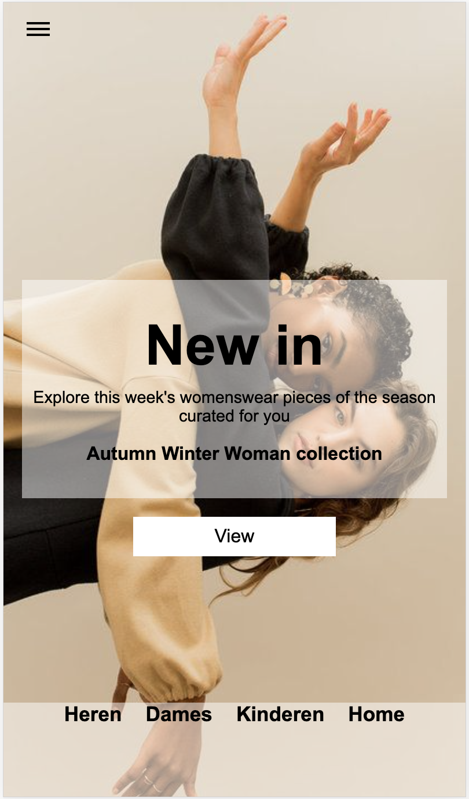
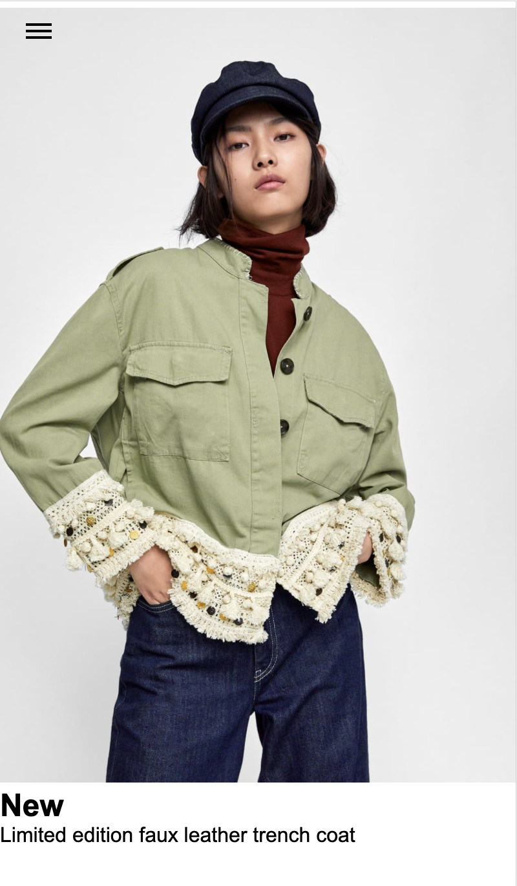
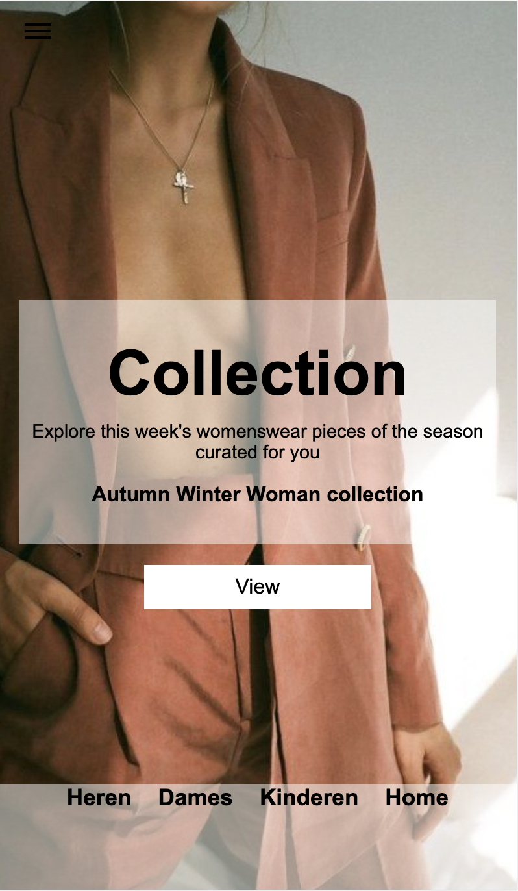
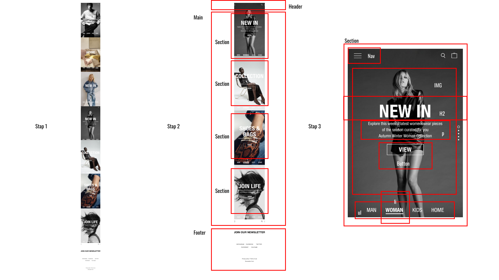

# Procesverslag
**Auteur:** -jouw naam-

Markdown cheat cheet: [Hulp bij het schrijven van Markdown](https://github.com/adam-p/markdown-here/wiki/Markdown-Cheatsheet). Nb. de standaardstructuur en de spartaanse opmaak zijn helemaal prima. Het gaat om de inhoud van je procesverslag. Besteedt de tijd voor pracht en praal aan je website.

## Bronnenlijst
1. -bron afbeeldingen: www.pinterest.com 
2. -bron 
3. -...-

## Eindgesprek (week 7/8)

-dit ging goed & dit was lastig-

**Screenshot(s):**

-screenshot(s) van je eindresultaat-

## Voortgang 3 (week 6)

-same as voortgang 1-

## Voortgang 2 (week 5)

-same as voortgang 1-

-dit ging goed & dit ging slecht
Het maken van de tweede pagina ging goed. Had alleen wel moeite met mediaquery, grids en ik probeerde een slideshow te maken met keyframes. Alleen ik hing een beetje vast omdat ik maar 1 image naar voren kreeg die knipperde. 
**Screenshot(s):**

## Voortgang 1 (week 3)

### Stand van zaken

### Agenda voor meeting

-28 september-
agendapunten:
keyframes (slideshow)
grids
Feedback 

-9 september -
Vraag over hamburger menu. 
Hoe kan je het beste een hamburger menu opstellen? Met behulp van een svg of op een andere manier.

### Verslag van meeting

-9 september-
Aan het begin van de meeting ging het een beetje stroef omdat niemand echt wat had voorbereid, maar er waren wel wat vragen die we uiteindelijk hebben behandeld. Ook moest elk van ons onze code laten zien. De docent gaf hier en daar wat tips over onze code en of het overzichtelijk eruit ziet.

## Intake (week 1)

**Je startniveau:** -Blauw-

**Je focus:** -surface plane-

**Je opdracht:** -https://www.zara.com/nl/-

**Screenshot(s):**

**Breakdown-schets(en):**

